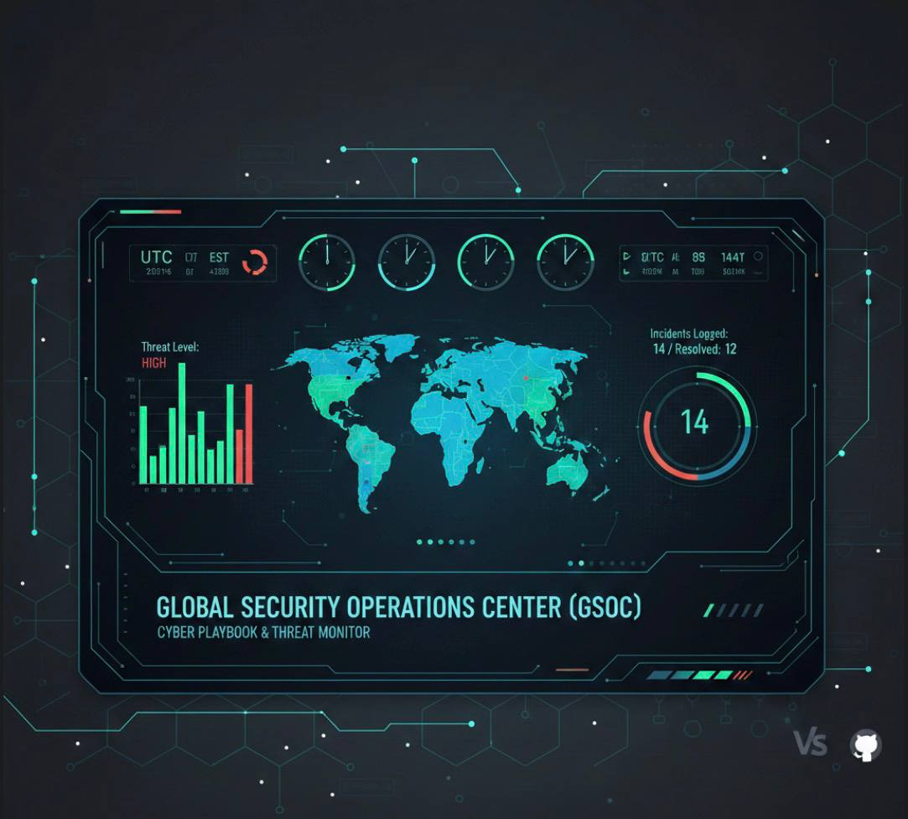

<link rel="icon" type="image/png" href="./favicon.png">

# SOC Operations & Incident Response Playbook

Author: Mercy Amarachi Agbayi

Focus: Incident Response (IR), Threat Mitigation, and Security Documentation.

## Project Overview

This repository serves as a centralized Security Operations Center (SOC) Wiki. It documents standardized procedures for responding to common cyber threats and provides a framework for analyzing security incidents. By utilizing "Infrastructure as Code" principles, this project ensures that security responses are repeatable, measurable, and transparent.

## 🛠️ Tech Stack & Tools

• VS Code: Primary environment for playbook development and Markdown linting.

• GitHub Actions: Automated validation of documentation structure.

• Mermaid.js: Integrated diagrams for visualizing attack lifecycles.

• Markdown: Standardized formatting for high readability.

## 📂 Repository Structure

Playbooks: Step-by-step guides for responding to active threats (e.g., Phishing).

Incidents: Post-mortem reports and root cause analysis of simulated breaches.

Assets: Network diagrams, attack flowcharts and evidence screenshots.

## Live Documentation

This Project is deployed using GitHub Pages.

You can view the formatted, searchable wiki here: 👉 [Visit site](https://pricelessempiresy.github.io/SOC-Playbook/)

## 📚 Current Playbooks

• Phishing Response: Procedures for identifying and neutralizing malicious email campaigns.

• Unauthorized access (Coming: Response steps for suspicious login activity.

• Malware Outbreak (Coming Soon): Containment and eradication of endpoint infections.

## 📈 Skills Demonstrated

• Incident Response Lifecycle: Mapping actions to the NIST SP 800-61 framework.

• Technical Writing: Translating complex security threats into actionable steps.

• Version Control: Managing security documentation using Git workflows.

• Threat Modeling: Visualizing attack vectors using Mermaid diagrams.

